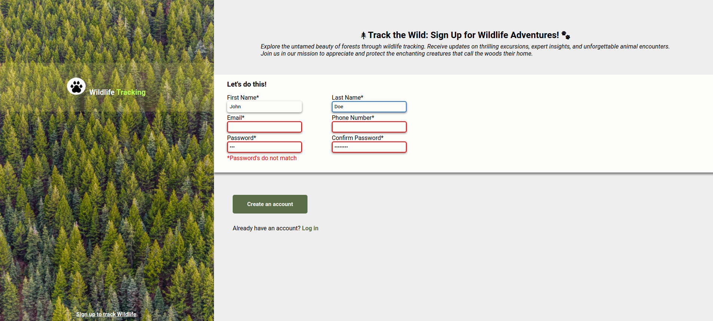

# Sign-up-Form
Live demo &#128073; https://masecurity.github.io/Sign-up-Form/
## What is this project about ?

This project is primarily about creating a sign-up form website, for a fictional wildlife tracking organization, using mainly HTML
and CSS and a bit of Javascript for password validation.

## What i learned
- The basics of how Forms work.
- Utilizing of HTML inbuilt validation's.
- Utilizing of CSS psuedo classes such as focus, valid and invalid.
- Utilizing of JavaScript to check if password entered were the same.
